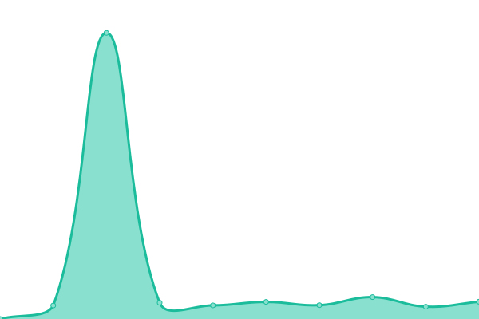
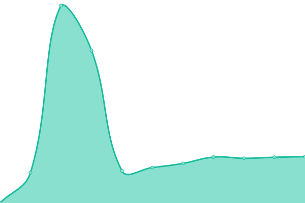

# [📈 Live Status](https://15x15G.github.io/upptime): <!--live status--> **全部在线 🟩**

This repository contains the open-source uptime monitor and status page for [15x15](https://15x15G.github.io/upptime), powered by [Upptime](https://github.com/upptime/upptime).

With [Upptime](https://upptime.js.org), you can get your own unlimited and free uptime monitor and status page, powered entirely by a GitHub repository. We use [Issues](https://github.com/15x15G/upptime/issues) as incident reports, [Actions](https://github.com/15x15G/upptime/actions) as uptime monitors, and [Pages](https://15x15G.github.io/upptime) for the status page.

<!--start: status pages-->
<!-- This summary is generated by Upptime (https://github.com/upptime/upptime) -->
<!-- Do not edit this manually, your changes will be overwritten -->
<!-- prettier-ignore -->
| URL | Status | History | Response Time | Uptime |
| --- | ------ | ------- | ------------- | ------ |
|  [ffcafe](https://ffcafe.org) | 🟩 在线 | [ffcafe.yml](https://github.com/15x15G/upptime/commits/HEAD/history/ffcafe.yml) | 

 326ms
     
 | 

<a href="https://15x15G.github.io/upptime/history/ffcafe">100.00%</a>
    

|  [cafeapi](https://cafemenu.lv5.one) | 🟩 在线 | [cafeapi.yml](https://github.com/15x15G/upptime/commits/HEAD/history/cafeapi.yml) | 

 1033ms
     
 | 

<a href="https://15x15G.github.io/upptime/history/cafeapi">100.00%</a>
    

|  [universalis](https://universalis.app/api/tax-rates?world=1175) | 🟩 在线 | [universalis.yml](https://github.com/15x15G/upptime/commits/HEAD/history/universalis.yml) | 

 293ms
     
 | 

<a href="https://15x15G.github.io/upptime/history/universalis">100.00%</a>
    

|  [笔窝](https://bot.pencilss.top/) | 🟩 在线 | [.yml](https://github.com/15x15G/upptime/commits/HEAD/history/.yml) | 

 4277ms
     
 | 

<a href="https://15x15G.github.io/upptime/history/">100.00%</a>
    

|  [獭窝](https://xn--v9x.net/hunt/sonar/) | 🟩 在线 | [.yml](https://github.com/15x15G/upptime/commits/HEAD/history/.yml) | 

 4277ms
     
 | 

<a href="https://15x15G.github.io/upptime/history/">100.00%</a>
    

<!--end: status pages-->

[**Visit our status website →**](https://15x15G.github.io/upptime)

## 📄 License

- Powered by: [Upptime](https://github.com/upptime/upptime)
- Code: [MIT](./LICENSE) © [15x15](https://15x15G.github.io/upptime)
- Data in the `./history` directory: [Open Database License](https://opendatacommons.org/licenses/odbl/1-0/)
